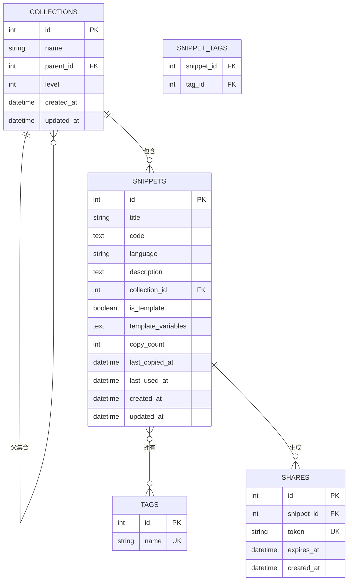

## 1. 架构设计

```mermaid
graph TD
    A["前端 React + TypeScript" --> B["后端 FastAPI + Python"
    B --> C["SQLAlchemy ORM"
    C --> D["SQLite 数据库"
    
    subgraph "前端层"
    A1["React Router 路由"
    A2["Monaco Editor 代码编辑"
    A3["TailwindCSS 样式"
    A4["Axios API 调用"
    A5["Context 状态管理"
    end
    
    subgraph "后端层"
    B1["FastAPI 路由层"
    B2["业务逻辑 Service 层"
    B3["数据访问 Repository 层"
    end
    
    subgraph "数据层"
    D1["snippets 片段表"
    D2["collections 集合表"
    D3["tags 标签表"
    D4["shares 分享表"
    end
```

## 2. 技术描述

### 2.1 前端技术栈
- **框架**：React 18 + TypeScript
- **构建工具**：Vite 5
- **样式**：TailwindCSS 3
- **代码编辑器**：@monaco-editor/react 4.6
- **路由**：react-router-dom 6
- **HTTP 客户端**：axios 1.6
- **图标**：lucide-react 0.3
- **拖拽**：@dnd-kit/core + @dnd-kit/sortable
- **语法高亮**：highlight.js
- **端口**：5173（随机选择，避开常用端口）

### 2.2 后端技术栈
- **框架**：FastAPI 0.109
- **ORM**：SQLAlchemy 2.0
- **数据库**：SQLite（本地文件）
- **数据验证**：Pydantic 2.0
- **异步支持**：async/await
- **CORS 支持**：fastapi.middleware.cors
- **端口**：8000（随机选择，避开常用端口）

### 2.3 项目结构
```
SnippetHub/
├── backend/
│   ├── app/
│   │   ├── main.py              # FastAPI 入口
│   │   ├── database.py          # 数据库连接
│   │   ├── models/              # SQLAlchemy 模型
│   │   ├── schemas/             # Pydantic 模式
│   │   ├── routers/             # API 路由
│   │   └── services/            # 业务逻辑
│   ├── requirements.txt
│   └── snippets.db              # SQLite 数据库文件
└── frontend/
    ├── src/
    │   ├── components/          # 通用组件
    │   ├── pages/               # 页面组件
    │   ├── contexts/            # React Context
    │   ├── services/            # API 服务
    │   ├── types/               # TypeScript 类型定义
    │   ├── utils/               # 工具函数
    │   └── App.tsx
    ├── package.json
    ├── vite.config.ts
    └── tailwind.config.js
```

## 3. 路由定义

| 前端路由 | 页面 | 功能 |
|---------|------|------|
| / | 首页 | 热门片段、最近使用 |
| /editor | 编辑页 | 片段创建、编辑 |
| /editor/:id | 编辑页 | 编辑指定片段 |
| /search | 搜索页 | 全文搜索结果 |
| /templates | 模板页 | 模板列表和使用 |
| /collections/:id | 集合页 | 指定集合下的片段 |
| /share/:token | 分享页 | 只读分享展示 |

## 4. API 定义

### 4.1 片段 API

```typescript
// 片段类型定义
interface Snippet {
  id: number;
  title: string;
  code: string;
  language: string;
  description: string;
  tags: string[];
  collection_id: number | null;
  is_template: boolean;
  template_variables: string[];
  copy_count: number;
  last_copied_at: string | null;
  last_used_at: string | null;
  created_at: string;
  updated_at: string;
}

// GET    /api/snippets              获取片段列表
// POST   /api/snippets              创建片段
// GET    /api/snippets/:id          获取片段详情
// PUT    /api/snippets/:id          更新片段
// DELETE /api/snippets/:id          删除片段
// POST   /api/snippets/:id/copy     记录复制
// POST   /api/snippets/:id/use      记录使用
// GET    /api/snippets/hot          热门片段 Top10
// GET    /api/snippets/recent       最近使用片段
// GET    /api/snippets/search       全文搜索
// POST   /api/snippets/from-template 从模板创建
```

### 4.2 集合 API

```typescript
interface Collection {
  id: number;
  name: string;
  parent_id: number | null;
  level: number;
  children: Collection[];
  snippet_count: number;
}

// GET    /api/collections           获取集合树
// POST   /api/collections           创建集合
// PUT    /api/collections/:id       更新集合
// DELETE /api/collections/:id       删除集合
// PUT    /api/snippets/:id/move     移动片段到集合
```

### 4.3 分享 API

```typescript
interface Share {
  id: number;
  snippet_id: number;
  token: string;
  expires_at: string | null;
  created_at: string;
}

// POST   /api/shares                创建分享
// GET    /api/shares/:token         获取分享内容
// DELETE /api/shares/:token         删除分享
```

### 4.4 标签 API

```typescript
// GET    /api/tags                  获取所有标签
// GET    /api/languages             获取支持的语言列表
```

## 5. 服务器架构

```mermaid
graph LR
    A["FastAPI 应用" --> B["Routers 路由层"]
    B --> B1["snippets.py"]
    B --> B2["collections.py"]
    B --> B3["shares.py"]
    B --> B4["search.py"]
    
    B --> C["Services 服务层"]
    C --> C1["SnippetService"]
    C --> C2["CollectionService"]
    C --> C3["ShareService"]
    C --> C4["SearchService"]
    C --> C5["TemplateService"]
    
    C --> D["Repositories 数据访问层"]
    D --> D1["SnippetRepository"]
    D --> D2["CollectionRepository"]
    D --> D3["ShareRepository"]
    
    D --> E["SQLAlchemy Models"]
    E --> F["SQLite Database"]
```

## 6. 数据模型

### 6.1 ER 图



### 6.2 DDL 语句

```sql
-- 集合表
CREATE TABLE collections (
    id INTEGER PRIMARY KEY AUTOINCREMENT,
    name VARCHAR(100) NOT NULL,
    parent_id INTEGER,
    level INTEGER NOT NULL DEFAULT 1,
    created_at DATETIME DEFAULT CURRENT_TIMESTAMP,
    updated_at DATETIME DEFAULT CURRENT_TIMESTAMP,
    FOREIGN KEY (parent_id) REFERENCES collections(id) ON DELETE CASCADE,
    CHECK (level <= 3)
);

-- 片段表
CREATE TABLE snippets (
    id INTEGER PRIMARY KEY AUTOINCREMENT,
    title VARCHAR(200) NOT NULL,
    code TEXT NOT NULL,
    language VARCHAR(50) NOT NULL,
    description TEXT,
    collection_id INTEGER,
    is_template BOOLEAN DEFAULT FALSE,
    template_variables TEXT,
    copy_count INTEGER DEFAULT 0,
    last_copied_at DATETIME,
    last_used_at DATETIME,
    created_at DATETIME DEFAULT CURRENT_TIMESTAMP,
    updated_at DATETIME DEFAULT CURRENT_TIMESTAMP,
    FOREIGN KEY (collection_id) REFERENCES collections(id) ON DELETE SET NULL
);

-- 标签表
CREATE TABLE tags (
    id INTEGER PRIMARY KEY AUTOINCREMENT,
    name VARCHAR(50) UNIQUE NOT NULL
);

-- 片段标签关联表
CREATE TABLE snippet_tags (
    snippet_id INTEGER NOT NULL,
    tag_id INTEGER NOT NULL,
    PRIMARY KEY (snippet_id, tag_id),
    FOREIGN KEY (snippet_id) REFERENCES snippets(id) ON DELETE CASCADE,
    FOREIGN KEY (tag_id) REFERENCES tags(id) ON DELETE CASCADE
);

-- 分享表
CREATE TABLE shares (
    id INTEGER PRIMARY KEY AUTOINCREMENT,
    snippet_id INTEGER NOT NULL,
    token VARCHAR(32) UNIQUE NOT NULL,
    expires_at DATETIME,
    created_at DATETIME DEFAULT CURRENT_TIMESTAMP,
    FOREIGN KEY (snippet_id) REFERENCES snippets(id) ON DELETE CASCADE
);

-- 索引
CREATE INDEX idx_snippets_language ON snippets(language);
CREATE INDEX idx_snippets_collection ON snippets(collection_id);
CREATE INDEX idx_snippets_template ON snippets(is_template);
CREATE INDEX idx_shares_token ON shares(token);
```

### 6.3 支持的编程语言

支持 15+ 种编程语言：
- JavaScript / TypeScript / JSX / TSX
- Python / Go / Rust / Java / C# / C++
- SQL / Shell / Bash
- HTML / CSS / JSON / YAML / Markdown
- PHP / Ruby / Swift / Kotlin
